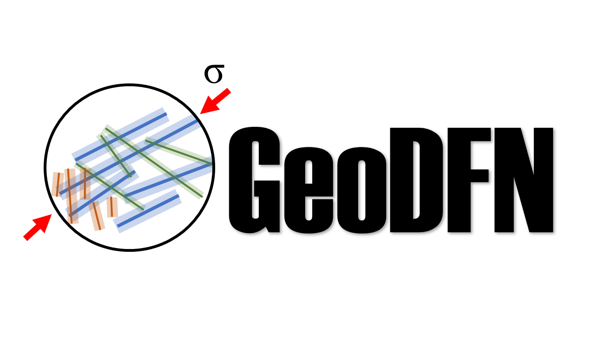

<div align="center">



# GeoDFN

### Geologically Consistent Discrete Fracture Network Generator

Generate ensembles of geologically plausible fracture networks from outcrop statistics - ready for flow and transport simulations.

<br/>

[-v2.0.0-0078D4?style=for-the-badge&logo=windows&logoColor=white)](https://github.com/kamelelahe/GeoDFN/releases/latest/download/GeoDFN-v2.0.0-Windows.zip)

<br/>

[](https://github.com/kamelelahe/GeoDFN/actions)
[](LICENSE)
[](https://www.python.org/)

</div>

---

## What is GeoDFN?

Fractures are ubiquitous in geological formations and can significantly influence heat and mass transfer in geothermal systems, groundwater management, and CO₂ storage. GeoDFN provides a computationally efficient workflow that bridges outcrop observations and dynamic flow simulations.

GeoDFN uses a **hybrid mechanical-statistical approach**: fracture lengths, orientations, and spacings are sampled from probability distributions fitted to field data, while fracture placement follows a mechanical rule - fractures are inserted sequentially (longest first), and each new fracture must respect the **stress shadow** (buffer zone) of existing fractures. This prevents unrealistically close spacing and produces fracture patterns that are geologically consistent without the high computational cost of full fracture growth simulations.

The result is an ensemble of equiprobable fracture networks that honour the statistical properties of the outcrop, can be constrained by observed clustering or exclusion zones, and feed directly into multi-purpose flow and transport simulators.

It ships in two forms - a **desktop app** for interactive use, and a **Python library** for scripting and large-scale ensemble generation.

---

## Get Started

### Option A - Desktop App (no Python required)

1. Click the **Download** button above
2. Unzip the file
3. Double-click **GeoDFN.exe** - your browser opens with the interface

### Option B - Python API

```bash
git clone https://github.com/kamelelahe/GeoDFN.git
cd GeoDFN
pip install -r requirements.txt
```

```python
import numpy as np
from GeoDFN.Classes.DFNGenerator import DFNGenerator

gen = DFNGenerator(
    domainLengthX=300, domainLengthY=600,
    sets=[{
        'I': 0.01,
        'fractureLengthPDF': 'Log-Normal',
        'fractureLengthPDFParams': {'mu': 2.4, 'sigma': 0.73, 'Lmin': 2.59, 'Lmax': 57.48},
        'spatialDistributionPDF': 'Power-law',
        'spatialDistributionPDFParams': {'alpha': 0.51, 'min distance': 1, 'max distance': 600},
        'orientationDistributionPDF': 'Von-Mises',
        'orientationDistributionPDFParams': {'kappa': 8.55, 'loc': 1.4,
                                              'thetaMin': np.radians(30), 'thetaMax': np.radians(120)},
        'bufferZone': {'method': 'constant', 'constant': 1.4},
    }],
    apertureCalculationParameters={'method': 'subLinear', 'scalingCoefficient': 0.001, 'scalingExponent': 0.5},
    DFNName='my_dfn',
    numOfRealizations=10,
)

print(f"{len(gen.realizations)} realizations generated")
```

---

## GUI or Python API?

| | Desktop GUI | Python API |
|---|---|---|
| **Best for** | Visual exploration, parameter tuning, quick results | Large ensembles, batch generation, simulation pipelines |
| **Setup** | Download & double-click | `pip install -r requirements.txt` |
| **Realizations** | Interactive, one run at a time | Hundreds to thousands, fully automated |

> For uncertainty quantification studies and generating training data for machine-learning emulators, we recommend the Python API. It allows full automation over the parameter space that defines the fracture network ensemble.

---

## Capabilities

| Feature | Options |
|---|---|
| **Fracture length** | Log-Normal · Power-law · Exponential · Constant |
| **Orientation** | Von-Mises · Uniform · Constant |
| **Spatial distribution** | Power-law · Log-Normal · Uniform |
| **Stress shadow (buffer zone)** | Constant width · Linear scaling with fracture length |
| **Aperture model** | Constant · Sub-linear scaling · Barton-Bandis · Lepillier |
| **Stress correction** | Multi-azimuth stress-dependent aperture |
| **Output** | Coordinates · Apertures · Statistics · Stereonets · Visualizations |

---

## Output

Each run writes results to `DFNs/<name>/`:

```
DFNs/<name>/
├── fractureCoordinates/       # Start/end (x, y) of each fracture
├── aperture/                  # Aperture values
├── fractureSet/               # Full fracture list per set
├── orientationStereographic/  # Stereonet plots
├── outputPropertiesTotal/     # Network statistics
└── pics/                      # DFN visualizations
```

---

## For Developers

<details>
<summary>Installation, tests, and building the desktop app</summary>

### Install with dev dependencies

```bash
pip install -e ".[dev]"
```

### Run tests

```bash
pytest tests/
```

### Build the desktop app

```bash
pip install pyinstaller
python -m PyInstaller geodfn.spec --noconfirm
```

Distributable is generated in `dist/GeoDFN/`. Share the entire folder - users double-click `GeoDFN.exe`.

### Project structure

```
GeoDFN/
├── Classes/
│   ├── DFNGenerator.py                      # Random-seed generator
│   ├── DFNGeneratorWithSeed.py              # Fixed seed-point generator
│   ├── DFNGeneratorWithSeedAndExclusion.py  # Generator with exclusion zones
│   ├── _validation.py                       # Input validation
│   ├── fractureLengthPDFs.py
│   ├── orientationPDFs.py
│   ├── spatialDistributionPDFs.py
│   ├── apertureCalculator.py
│   └── bufferZoneCalculator.py
├── Example-BrazilRandomSeeds.py
├── Example-BrazilFixedSeeds.py
├── Example-BrazilFixedSeedsAndExclusion.py
├── Example-BrazilAperture.py
├── Examples.ipynb
└── PercolationAnalysis.ipynb
app.py          # Streamlit GUI
launcher.py     # Desktop app entry point
geodfn.spec     # PyInstaller build spec
```

</details>

---

## Citation

If you use GeoDFN in your research, please cite:

> Kamel Targhi, E., et al. "From outcrop observations to dynamic simulations: an efficient workflow for generating ensembles of geologically plausible fracture networks and assessing their impact on flow and transport." *Geoenergy* 3.1 (2025): geoenergy2025-028.

---

## License

MIT License - © 2025 Elahe Kamel Targhi. See [LICENSE](LICENSE) for details.
